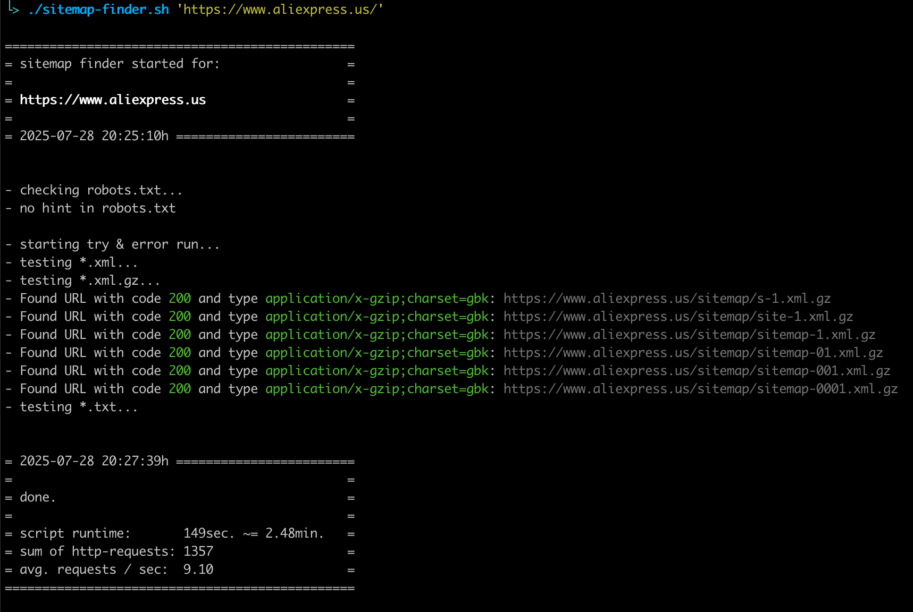

# Abro's (XML) Sitemap Finder

A battle-tested bash script to find XML sitemaps on a website.

## The Problem

You know the drill. You're doing an audit, and the first thing you check is `robots.txt` for the sitemap location. Most of the time, it's right there. But sometimes... it's not.

So you start guessing. `sitemap.xml`, `sitemap_index.xml`, `sitemap-1.xml`... you poke around for a few minutes and maybe you find it. This script does that guesswork for you. If it comes up empty, you can be confident that further black-box testing is pointless. It's time to pick up the phone and call the client.

## The Solution

It's a simple, two-stage process:

1. **The Civilized Method**: It first checks `/robots.txt` for a `Sitemap:` entry. If it finds one, it prints it, and we're all happy.
2. **The Brute-Force Method**: If `robots.txt` comes up empty _(or `QUIT_ON_FIRST_RESULT` is `0`)_, the script methodically tests a list of over 1,300 potential sitemap URLs based on paths i've seen in the wild over the years.

The script checks each candidate URL via HEAD requests, until it receives a `2xx` status code and a content type that looks like XML, GZIP, or plain text. (Since Google allows sitemaps in `.txt` format, we check for that too.)

## Usage

1. Make it executable:

   ```bash
   chmod +x sitemap-finder.sh
   ```

2. Run it against a website:

   ```bash
   ./sitemap-finder.sh 'https://www.example.com/'
   ```

### Example Output

```
===============================================
= sitemap finder started for:                 =
=                                             =
= https://www.example.com                     =
=                                             =
= 2025-07-28 20:11:26h ========================


- checking robots.txt...
- no hint in robots.txt

- starting try & error run...
- testing *.xml...
- Found URL with code 200 and type application/xml: https://www.example.com/en/googlesitemap.xml
- testing *.xml.gz...
- testing *.txt...


= 2025-07-28 20:14:14h ========================
=                                             =
= done.                                       =
=                                             =
= script runtime:       168sec. ~= 2.80min.   =
= sum of http-requests: 1357                  =
= avg. requests / sec:  8.07                  =
===============================================
```

Real-life example:



## Configuration

You can tweak the script's behavior by editing the file directly.

- `QUIT_ON_FIRST_RESULT`: By default, this is `"0"`, so the script will keep searching even after it finds a valid sitemap. Set it to `"1"` if you want it to exit immediately after the first hit.

### Dependencies

You probably already have these, but the script needs:

- `bash`
- `curl`
- `tput` (for the fancy colors)
- `bc` (for the math at the end)
- `perl` (for that one little regex)
